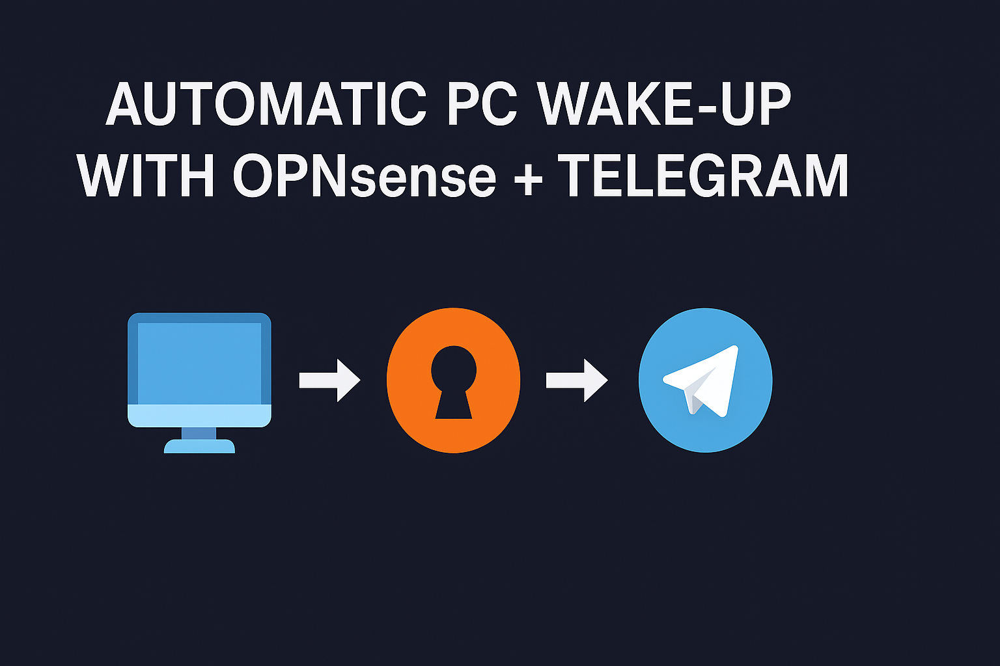

# 🖥️ OPNsense Auto Wake-on-LAN with Telegram Alerts 🇨🇱

Automate PC startup in a school or lab environment using OPNsense + Telegram + holiday detection via API.

## ⚙️ Features

- Broadcast WoL to all PCs via MAC list
- Ping check to confirm boot status
- Telegram alerts to multiple users
- Skips execution if today is a holiday (Chile)
- Custom command in OPNsense GUI

## 📁 File Structure

- `data/wake_macs.txt`: MACs and IPs list
- `scripts/wake_multiple.sh`: Main logic script
- `config/actions_wake_on_lan.conf`: OPNsense action config

## 📦 Requirements

- OPNsense with `os-wol` plugin installed
- SSH or terminal access to OPNsense
- Telegram bot + chat IDs
- Internet access to query holidays (optional)

## 📝 Example Entry in `wake_macs.txt`

```
#inicio laboratorio
70:85:C2:C0:EF:A4       # 192.168.10.1
34:17:EB:CD:45:12       # 192.168.10.2
90:2B:34:8C:AA:56       # 192.168.10.3
00:11:22:33:44:55       # 192.168.10.4
00:11:22:33:44:66       # 192.168.10.5
00:11:22:33:44:77       # 192.168.10.6
00:11:22:33:44:88       # 192.168.10.7
00:11:22:33:44:99       # 192.168.10.8
00:11:22:33:44:AA       # 192.168.10.9
00:11:22:33:44:BB       # 192.168.10.10
```

## 📌 Cron Setup (Example)

Run every weekday at 7:30 AM:

```cron
30 7 * * 1-5 root /usr/local/bin/wake_multiple.sh
```

## 🔐 Security

No external services are exposed. Telegram tokens are private. WoL is local broadcast only.

## 🌎 Holiday API

Used: `https://date.nager.at/api/v3/PublicHolidays/{YEAR}/CL`  
If today is a public holiday in Chile, the script aborts.

## 📜 License

MIT
